Virtual Network Penetration Test & Remediation Analysis

## Overview

I built an isolated virtual lab with three Virtual Machines to practice network scanning, service analysis, and exploitation. The three virtual machines were Kali Linux (attacker), Ubuntu (target 1), Metasploitable2(target 2) all fully isolated on a Host-only network to ensure security against internet exposure. The process started with discovering the IP address of each virtual machine, followed by Testing connectivity from Kali by pinging both Ubuntu and Metaploitable 2 virtual machines. During the Network testing portion, I ran Nmap scans from the Kali VM against Ubuntu and Metasploitable2 while simultaneously recording network traffic with Wireshark. These scans revealed open ports and service versions on both targets, which I then exploited using metasploit. The offensive part highlights my use of metasploit on the Kali VM to gain root-level access to the Metasploitable2 virtual machine, demonstrating full compromise of the target machine.

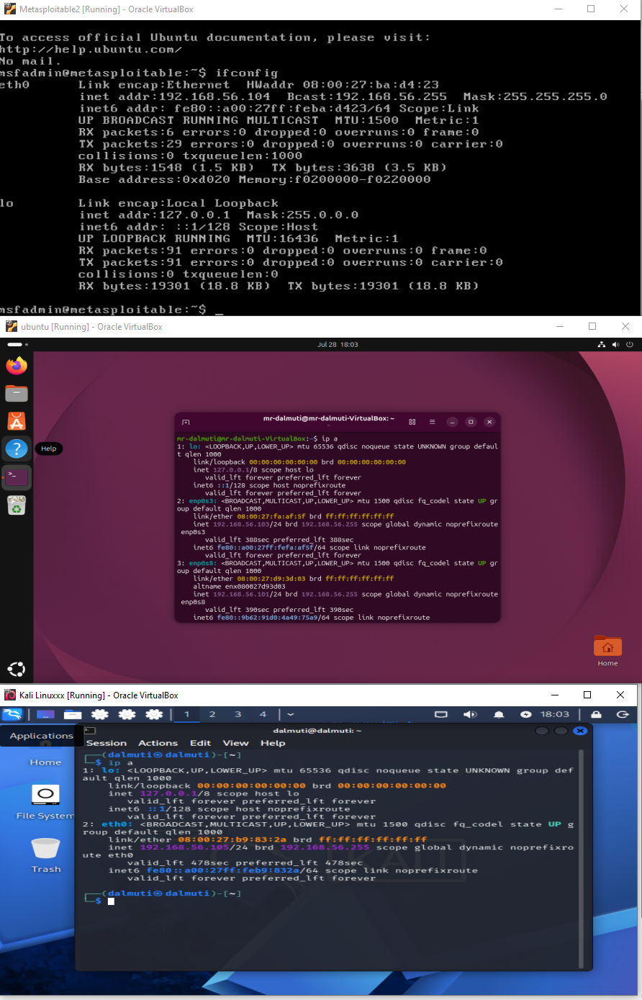

## Security Concepts

- Vulnerabilities- A weakness or opening in a system that allows hackers to gain access injecting exploits or cause a security breach. One of the Vulnerabilities found during my "nmap –script vuln" scan revealed an Open Service on port 21 ftp, with the Vulnerable section being VsFTPD version 2.3.4 backdoor. The vsFTPd 2.3.4 backdoor is a famous security flaw (CVE-2011-2523) where an unknown attacker added malicious code to the official source code in 2011. This code allows users to log into the FTP server with a special username allowing the software to open a command shell with root access .
- Exposed Services-
- Why Security matters- Vulnerabilities allow for threat actors to carry out cyber attacks that can be very detrimental to a service. These vulnerabilities are often in the form of open ports that carry unpatched, outdated, or misconfigured service, not anything crazy like a zero-day attempt.

| Target | Port | Service | Version | Notes |
|---|---|---|---|---|
| Metasploit2 | 21 | ftp | Vsftpd 2.3.4 | Known backdoor vulnerability |
| Metasploitable2 | 22 | ssh | OpenSSH 4.7p1 Debian 8ubuntu1 | Old version, plaintext-free but outdated |
| Metasploitable2 | 23 | telnet | Linux telnetd | Plaintext protocol — credentials sent unencrypted |
| Metasploitable2 | 25 | smtp | Postfix smtpd | Mail server,default config |
| Metasploitable2 | 53 | Domain | ISC BIND 9.4.2 | Old version, known BIND CVEs exist historically |
| Metasploitable2 | 80 | http | Apache httpd 2.2.8 (Ubuntu) DAV/2 | Outdated Apache, WebDAV enabled |
| Metasploitable2 | 111 | rpcbind | RPC | Often used to enumerate other RPC services |
| Metasploitable | 139 | netbios-ssn | Samba smbd 3.X-4.X | Legacy Samba, historically exploitable |
| Metasploitable2 | 445 | netbios-ssn(SMB) | Samba smbd 3.X-4.X | Same as above, SMD direct |
| Metasploitable2 | 512 | exec | Netkit-rsh rexecd | Remote execution service, no encryption |
| Metasploitable2 | 513 | login | rlogind | Legacy remote login, plaintext |
| Metasploitable | 514 | shell | Netkit rshd | Remote shell, no authentication encryption |
| Metasploitable2 | 1099 | java-rmi | GNU Classpath grmiregistry | Can allow remote code execution if misconfigured |
| Metasploitable2 | 1524 | bindshell | Metasploitable Root shell | Backdoor root shell - not auth required |
| Metasploitable2 | 2049 | Nfs | RPC | Network file sharing, can expose files if misconfigured |
| Metasploitable2 | 2121 | Ftp | ProFTPD 1.3.1 | Second FTP service, older version |
| Metasploitable2 | 3306 | mysql | MySQL 5.0.51a-3ubuntu5 | Very outdated DB version |
| Metasploitable2 | 3632 | disctccd | Distccd v1 | Known RCE vulnerability in old distcc |
| Metasploitable2 | 5432 | postgresql | PostgreSQL 8.3.0-8.3.7 | Outdated DB version |
| Metasploitable | 5900 | vnc | VNC protocol 3.3 | Old VNC, weak/no auth by default |
| Metasploitable2 | 6000 | X11 | (access denied) | X11 exposure is a common misconfig risk |
| Metasploitable2 | 6667 | irc | UnrealIRCd | This exact service/version has a well-known backdoor too |
| Metasploitable2 | 8009 | ajp13 | Apache Jserv Protocol 1.3 | Tomcat Connector, has known exploits (ghostcat) |
| Metasploitable2 | 8180 | Http | Apache Tomcat/Coyote JSP 1.1 | Default creds risk on Tomcat manager |
| Metasploitable2 | 41823 | mountd | Rpc | Related to NFS, part of same exposure |
| Metasploitable2 | 47604 | nlockmgr | RPC | RPC service, part of NFS locking |
| Metasploitable2 | 55812 | Status | RPC | RPC status daemon |
| Metasploitable2 | 59326 | java-rmi | GNU Class path grmiregistry | Second RMI instance |
| Ubuntu | 21 | ftp | Vsftpd 3.0.5 | Current,patched version - no known vulnerabilities flagged |
| Ubuntu | 22 | ssh | OpenSSH 10.2p1 Ubuntu 2ubuntu3.5 | Current,patched version |
| Ubuntu | 80 | http | Apache httpd 2.4.66 | Current version; vuln scan checked for stored XSS, CSRF, DOM-based XSS - none found |

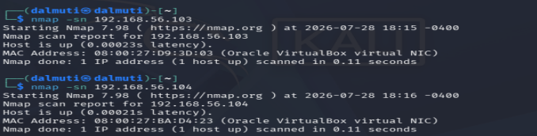

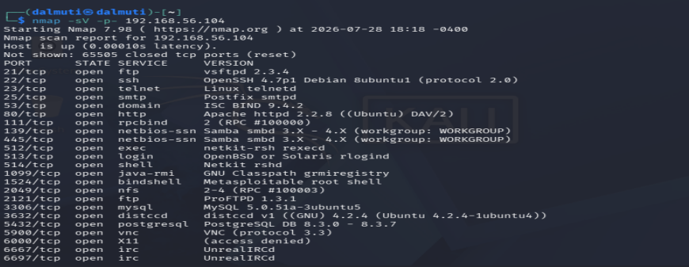

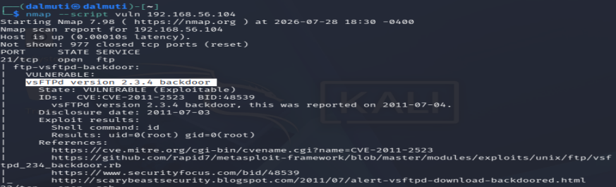

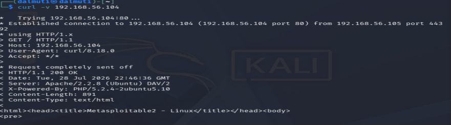

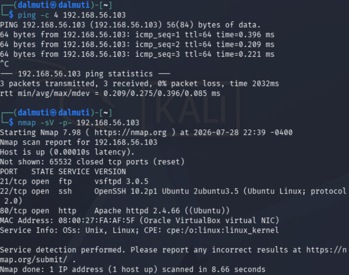

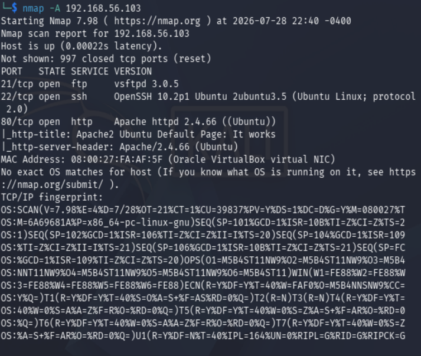

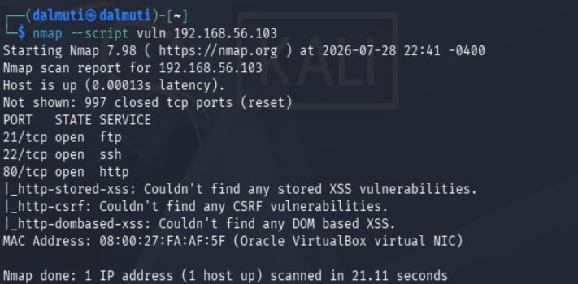

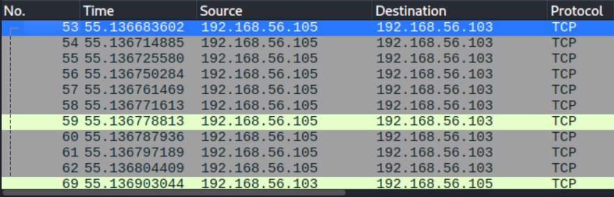

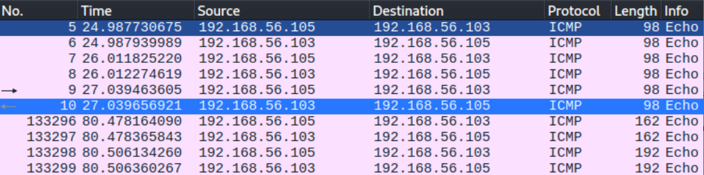

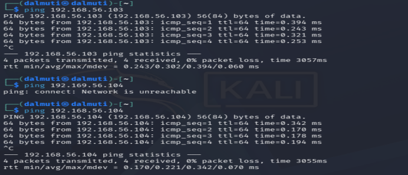

## 4. Exploitation (Metasploitable2)

The vulnerability I exploited during this phase was a known backdoor in vsftpd 2.3.4 (CVE-2011-2523), running on the Metasploitable 2 virtual machine. This version contained a backdoor planted by a hacker in the source code, which could be utilized by sending a designated password. As shown below, I was able to gain root-level access, due to the exploitation, allowing for the high privilege level on the linux system - meaning the attacker could fully control the target machine: reading files, delete systems foundation, install malicious software, or keep root access.

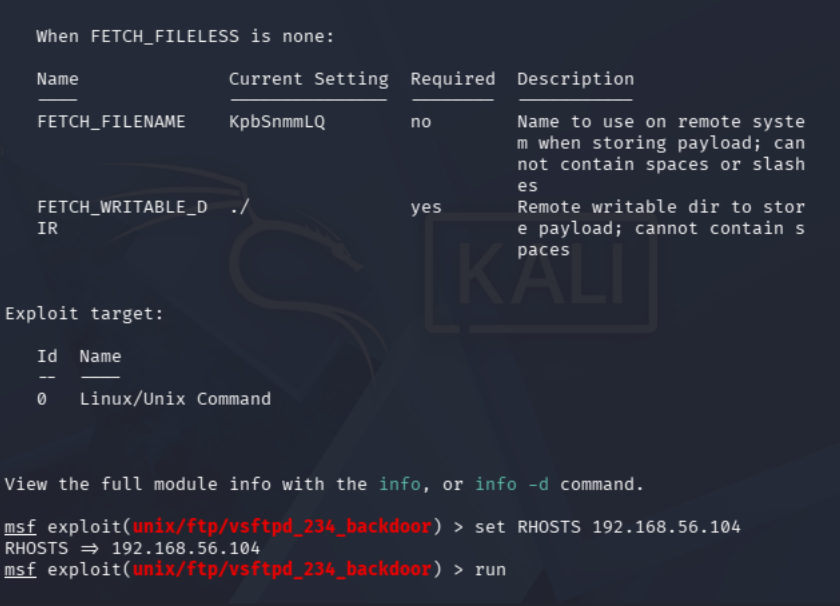

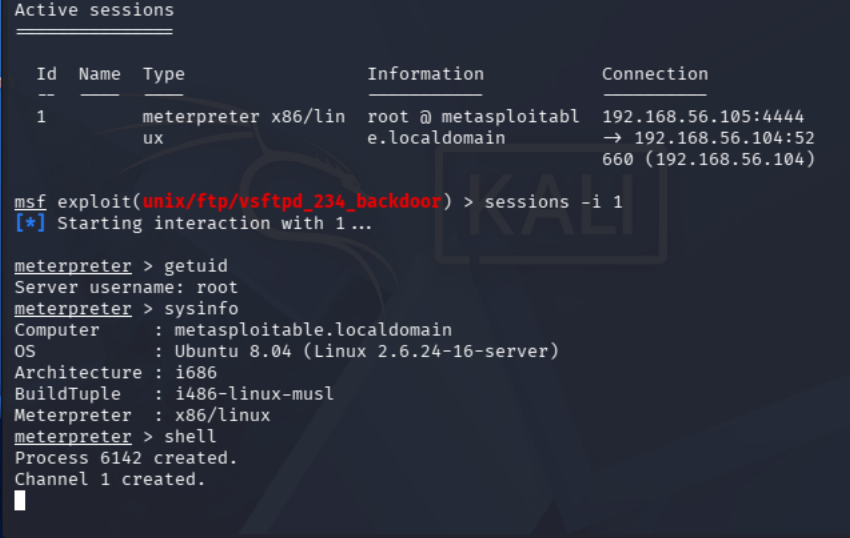

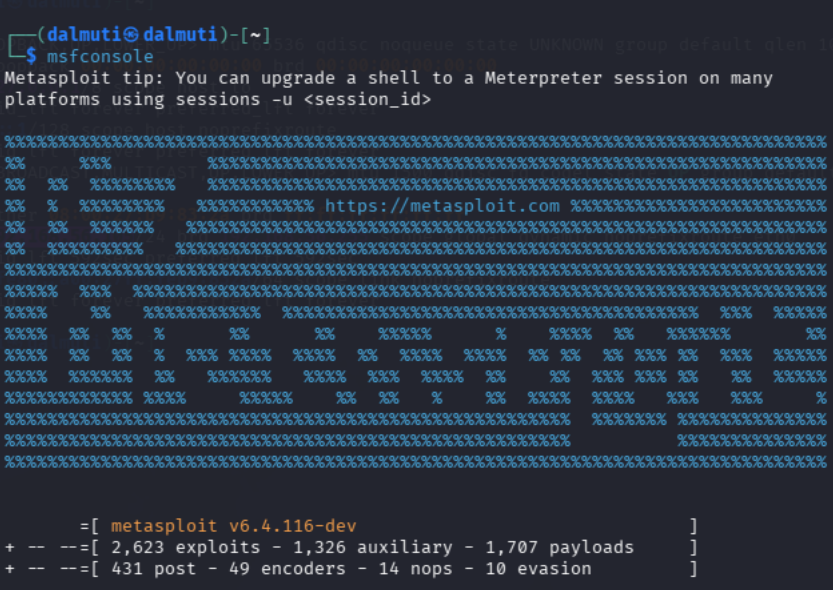

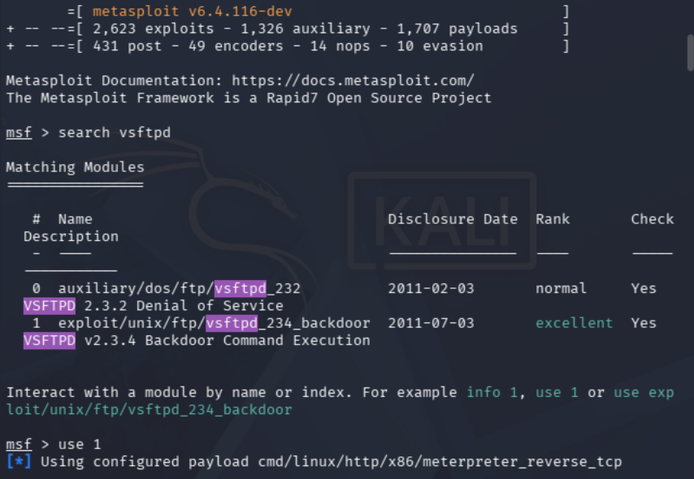

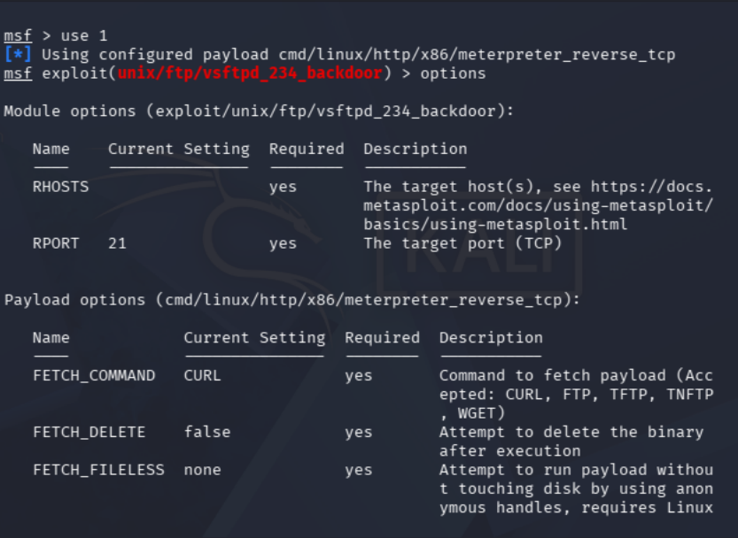

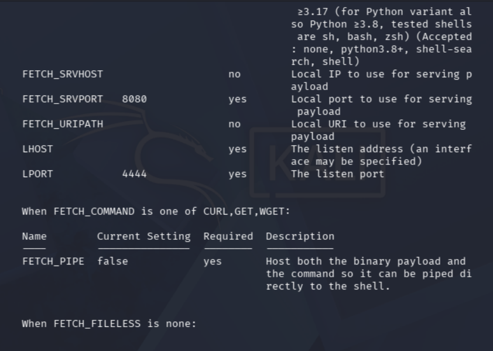

## 5. Remediation

- Update vsftpd to a patched version, or replace it with a maintained FTP server
- Disable the FTP service if possible to mitigate vulnerabilities
- Add the vulnerable version to a monitoring software

## 6. Reflection

What confused me the most throughout this process was in the actual exploitation process when finding out I was inside a meterpreter session instead of a plain shell. Meterpreter is Metasploit's post-exploitation environment with its own different set of commands different from the shell. This was a problem because I was trying to use commands meant for the shell, which led to error messages popping up as a result. The reason for all of this was the current versions of Metasploit, the specific exploit module utilized default payload that updated from a plain command shell to meterpreter console. So when I ran the exploit with the default payload settings, Metasploit automatically ran a full meterpreter session instead of the plain shell.

Throughout this whole project I was able to apply what I've been learning on TryHackMe Junior Penetration Tester and Soc Level 1 learning path. The Key open-source tools that were utilized including wireshark, nmap, and metasploit were all seen as a review from what I learned previously allowing me to fully grasp what real world junior penetration testing is like.

